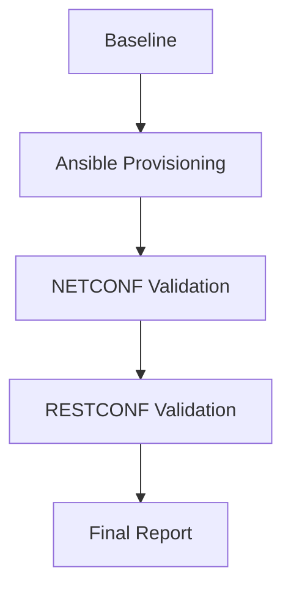

<!-- PORTADA -->

<h1 align="center">🚀 Network Automation Project</h1>

<p align="center">
  <b>Cisco CSR1000v | Automation | Validation | DevNet</b>
</p>

<p align="center">
  
  
  
  
  
  
</p>

---

## 🎬 Demo del Proyecto

<p align="center">
  
</p>

> 🔎 Simulación de automatización, validación y control de red en entorno Cisco

---

## 👨‍💻 Autor

**Diego Esteban Molina Romero**
🔗 https://github.com/diemolinar-prog

---

## 🧠 Visión del Proyecto

Este proyecto representa un flujo completo de **automatización de red moderna**, integrando herramientas utilizadas en entornos profesionales:

* Infraestructura como código
* Validación automatizada
* APIs de red
* Testing de estado

---

## ⚡ Flujo de Automatización



---

## 🧱 Arquitectura

```bash
ep3-automatizacion-005D-11/
│
├── fase1_baseline/
├── fase2_aprovisionamiento/
├── fase3_validacion_netconf/
├── fase4_validacion_restconf/
├── fase5_reporte/
│   └── evidencias/
│
└── playbook_005D-11.yaml
```

---

## 🛠️ Stack Tecnológico

| Categoría            | Herramienta        |
| -------------------- | ------------------ |
| Automatización       | Ansible            |
| Testing              | pyATS / Genie      |
| APIs                 | NETCONF / RESTCONF |
| Lenguaje             | Python             |
| Red                  | Cisco IOS XE       |
| Control de versiones | Git                |

---

## 🔥 Features Implementadas

✔️ Configuración automática de router
✔️ Idempotencia garantizada
✔️ Validación por API
✔️ Snapshot de estado
✔️ Comparación de configuraciones
✔️ Reporte final automatizado

---

## 🧪 Validaciones

### ✔️ NETCONF

* Hostname
* Loopback
* WAN
* NTP

### ✔️ RESTCONF

* Interfaces
* Configuración

📌 Resultado global:

```bash
CONFORME
```

---

## 📊 Snapshot Final

Debido a limitación de pyATS con banners personalizados:

✔️ Se realizó captura manual validada:

```bash
show ip interface brief
show running-config
show ip route
```

📄 Archivo:

```bash
snapshot_final_manual.txt
```

---

## 🔍 Cambios Detectados

* Hostname → RTR-SEGPROV
* Loopback → 10.5.11.1
* WAN vía DHCP
* NTP activo
* APIs habilitadas
* Banner de seguridad

---

## 🧠 Troubleshooting Real

Problema:

* Incompatibilidad de **Genie + banner IOS XE**

Solución:

* Validación manual con evidencia CLI

✔️ Enfoque profesional aplicado

---

## 🏆 Resultado Final

```bash
===================================
RESULTADO FINAL DE AUTOMATIZACION
===================================
ESTADO: CONFORME
```

---

## 🚀 Habilidades Demostradas

* Network Automation
* API Networking
* Troubleshooting real
* DevNet workflow
* Git & documentación

---

## 📈 Perfil Profesional

Este proyecto demuestra capacidades en:

✔️ Ingeniería de redes moderna
✔️ Automatización empresarial
✔️ Validación y testing
✔️ Resolución de problemas reales

---

## 📬 Contacto

🔗 GitHub: https://github.com/diemolinar-prog

---

<p align="center">
  <b>🔥 Proyecto listo para portafolio profesional</b><br>
  <i>Network Automation • DevNet • Cisco Engineering</i>
</p>

